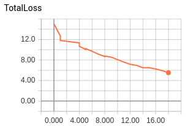
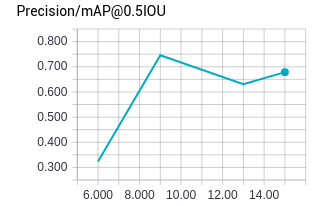
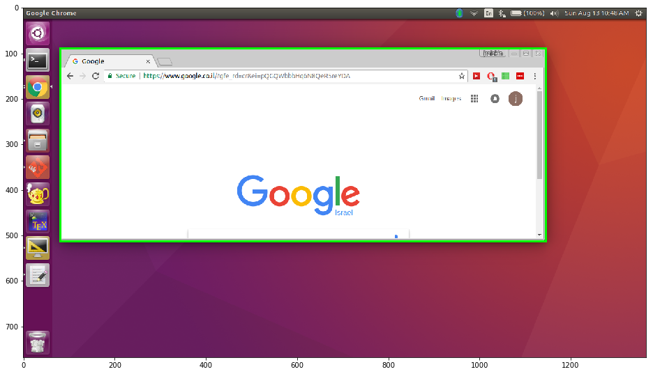
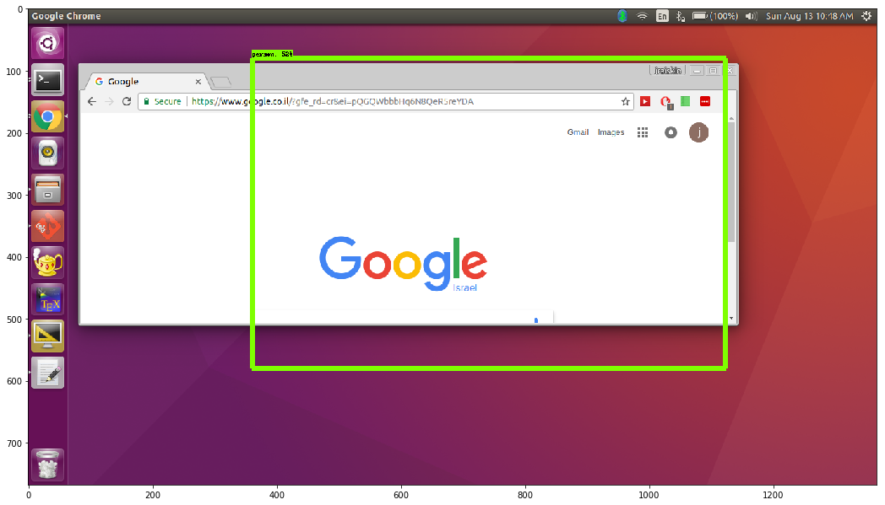

# Object detection - Chrome window in screenshot

An object detector, using
[TensorFlow’s Object Detector API](https://github.com/tensorflow/models/tree/master/object_detection).

This detector is not in working condition, but rather a proof of concept.
It is trained on one class, 
a Chrome browser window, on a screenshot taken on my machine (Ubuntu).

Written with Python 3.5 and Tensorflow 1.2. Please follow the
[installation instructions](https://github.com/tensorflow/models/blob/master/object_detection/g3doc/installation.md).

## A quick and dirty overview of how to replicate my results
```bash
# download a frozen graph by running screenshot_detector/screenshot_object_detector.ipynb

# from TF_screenshots_object_detector/

#### create the data set
cd image_resources
# generate screenshots (parameters such as screen size and other restrictions may needed to be changed)
source generate_chrome_screenshots.sh
# create CSV for labels
python create_image_csv_and_labels.py
# create TFrecord format file (training set)
python generate_tfrecord.py \
--csv_input=training_labels.csv \
--image_dir=training_set  \
--output_path=train.record
# create TFrecord format file (test set)
python generate_tfrecord.py \
--csv_input=test_labels.csv \
--image_dir=test_set  \
--output_path=test.record

#### from TF_screenshots_object_detector/
# train model, evaluate and export graph for inference
cd ..

# run training job
python object_detection/train.py \
    --logtostderr \
    --pipeline_config_path=screenshot_detector/ssd_mobilenet_v1_coco_11_06_2017/ssd_mobilenet_v1_pets_screenshots.config \
    --train_dir=screenshot_detector/ssd_mobilenet_v1_coco_11_06_2017/

# run evaluation job
python object_detection/eval.py \
    --logtostderr \
    --checkpoint_dir=screenshot_detector/ssd_mobilenet_v1_coco_11_06_2017/ \
    --eval_dir=screenshot_detector/ssd_mobilenet_v1_coco_11_06_2017/eval_dir \
    --pipeline_config_path=screenshot_detector/ssd_mobilenet_v1_coco_11_06_2017/ssd_mobilenet_v1_pets_screenshots.config

# launch tensorboard to track progress (optional)
tensorboard --logdir='screenshot_detector/ssd_mobilenet_v1_coco_11_06_2017'

# export trained model (makes loading and inference much easier)
python object_detection/export_inference_graph.py \
    --input_type image_tensor \
    --pipeline_config_path screenshot_detector/ssd_mobilenet_v1_coco_11_06_2017/ssd_mobilenet_v1_pets_screenshots.config \
    --trained_checkpoint_prefix screenshot_detector/ssd_mobilenet_v1_coco_11_06_2017/model.ckpt-15 \
    --output_directory screenshot_detector/my_semi_trained_inference_graph
```

## Generating data

First, I needed to generate data from scratch.
Luckily, screenshots are cheap to come by.

I used [`image_resources/generate_chrome_screenshots.sh`](image_resources/generate_chrome_screenshots.sh)
to genearte screenshots automatically.
I hand coded values, such as fixing the browser to Google Chrome, my screen dimensions,
as well restrictions, such as minimal browser window size and screen edges (launch bar and status bar coordinates).
The script generates (semi) random locations on the screen and window sizes, using the 
`wmctrl` package to access the window manager.
Saving the screenshot was done with `imagemagick`.
Both packages are native to Ubuntu 16.04 (as far as I know).
This way, 200 observations were created, 40 of which were reserved for testing.

While moving the browser window around, the location is logged and saved to [`windows_positions.csv`](image_resources/windows_positions.csv).
Based on this file, two other CSV files were created, one for training and one for testing.
These files are necessary in order to adhere to the [TFRecord file format](https://www.tensorflow.org/api_guides/python/python_io#tfrecords_format_details).
Generating TFRecord file is done by [`generate_tfrecord.py`](image_resources/generate_tfrecord.py), 
as well as creating the label maps,
was done based on the 
[Preparing Inputs tutorial](https://github.com/tensorflow/models/blob/master/object_detection/g3doc/using_your_own_dataset.md)

## Training (partly!) and evaluation

Download the [`ssd_mobilenet_v1_coco`](http://download.tensorflow.org/models/object_detection/ssd_mobilenet_v1_coco_11_06_2017.tar.gz).
This can also be done by running
[`screenshot_detector/screenshot_object_detector.ipynb`](screenshot_detector/screenshot_object_detector.ipynb),
a notebook partly based on [TensorFlow's Object Detection Demo](https://github.com/tensorflow/models/blob/master/object_detection/object_detection_tutorial.ipynb).
The `ssd_mobilenet_v1_coco` model was chosen among the [object detection models provided by TensorFlow](https://github.com/tensorflow/models/blob/master/object_detection/g3doc/detection_model_zoo.md),
since it is fast but not as accuracte, which suffices for our purpose.

Training was enhanced by transfer learning, using a pre-trained model, 
as provided in [TensorFlow's Object Detection Demo](https://github.com/tensorflow/models/blob/master/object_detection/object_detection_tutorial.ipynb).

Hyper-parameters in the config file were largely kept at default values,
based on the [pet detector's config file](https://github.com/tensorflow/models/blob/master/object_detection/samples/configs/ssd_mobilenet_v1_pets.config).

Evaluation is done based on the Mean Average Precision (MAP or AP), % AP at IoU=.50 (PASCAL VOC metric),
as defined by the [COCO dataset](http://mscoco.org/dataset/#detections-eval).

Exporting the inference graph is done by
[`object_detection/export_inference_graph.py`](object_detection/export_inference_graph.py),
based on [this guide {NOTE the arguments in the guide are wrong! use the file as instructed here!}](https://github.com/tensorflow/models/blob/master/object_detection/g3doc/exporting_models.md). 

Lastly, load the exported inference graph in visualize results in
[`screenshot_detector/screenshot_object_detector.ipynb`](screenshot_detector/screenshot_object_detector.ipynb).

## Results

Results are hardly impressive, but hey, this is just a proof of concept!
Training was done on my CPU for about 40 minutes and nearly fried my computer.

Training loss goes down:

<p align="center">
  
</p>

MAP goes (mostly) up:

<p align="center">
  
</p>

Now let's compare the detector's work with the ground truth:

<p align="center">
  
  
</p>

Not great, but still remarkable, considering the very limited training time and computing power.
The power of these results is mainly attributed to transfer learning.

## Copyright

See [LICENSE](LICENSE.md) for details.
Copyright (c) 2017 jraiskin.


